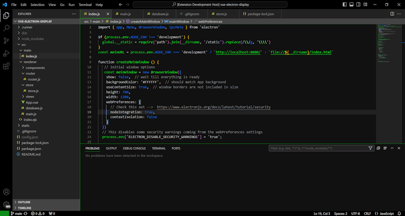

# Chill Hacker Dark

### A theme for VS Code

My plan is an application interface that was very simple relaxing dark and then the syntax highlighting would have
various greens and grays for the hacker style look.  

Here's the look so far:  

### Here are some tools to help
  
Open a window to preview changes:  Run > Start Debugging  
  
A list of colors related to the application interface:  https://code.visualstudio.com/api/references/theme-color    

A Youtube video about making and publishing themes:  https://www.youtube.com/watch?v=pGzssFNtWXw

### Notes  
Title bar - very top bar on application window  
Panel - terminal window  
Editor - where you write code  
Activity bar - far left column   
Menu - dropdown menus at top  
Breadcrumbs - bar above editor that shows file path  
Side bar - column with filenames, etc  
Tab - various areas where the tabs for open files are  
EditorGroupHeader.tabsBackground - the area beside the tabs  
Minimap - far right column  
Status bar - very bottom bar on application window  

Bright Green - 0A8F18  
Bright Blue - 1669D9